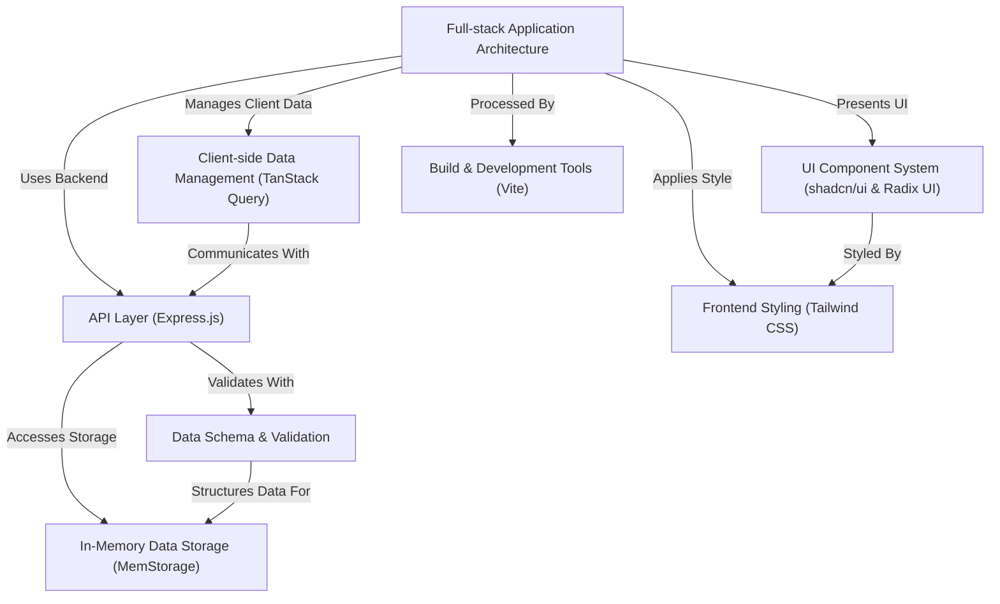

# MZeeshanWPPortfolio


A modern, full-stack portfolio application for a WordPress developer, showcasing a responsive user interface and a robust backend. Built with a focus on performance, accessibility, and developer experience, this project demonstrates a complete web application with a contact form, dynamic UI components, and efficient data management.

## Table of Contents
- [Project Overview](#project-overview)
- [Architecture](#architecture)
- [Technologies Used](#technologies-used)
- [Getting Started](#getting-started)
  - [Prerequisites](#prerequisites)
  - [Installation](#installation)
  - [Running the Project](#running-the-project)
- [Project Structure](#project-structure)
- [Contributing](#contributing)
- [License](#license)

## Project Overview

MZeeshanWPPortfolio is a full-stack web application designed to showcase a WordPress developer's projects and services. It features:

- **Responsive UI**: Built with React, shadcn/ui, and Radix UI for an accessible and visually appealing interface.
- **Contact Form**: Securely sends messages to the developer, validated both on the frontend and backend.
- **Efficient Data Management**: Utilizes TanStack Query for client-side data handling and Express.js for a robust API layer.
- **Developer-Friendly Tools**: Powered by Vite for fast development and optimized builds, with Tailwind CSS for styling and MemStorage for in-memory data storage during development.

This project serves as a tutorial to guide developers through building a modern web application, covering key concepts like full-stack architecture, UI component systems, and data validation.

## Architecture

The application follows a full-stack architecture with a clear separation of concerns between the frontend and backend:



### Key Components
- **Frontend**: Handles user interactions, displays the portfolio, and communicates with the backend via API calls.
- **Backend**: Manages data processing, validation, and storage, ensuring secure and reliable operations.
- **Data Flow**: The frontend sends requests (e.g., contact form submissions) to the backend, which validates and stores data before sending a response.

## Technologies Used

| Technology | Description |
|------------|-------------|
| **React** | Frontend library for building a dynamic and responsive UI. |
| **TypeScript** | Adds static types to JavaScript for better code reliability and maintainability. |
| **Node.js** | Runtime environment for executing JavaScript on the server-side. |
| **Express.js** | Backend framework for creating a robust API layer. |
| **Tailwind CSS** | Utility-first CSS framework for rapid and consistent styling. |
| **Vite** | Fast build tool and development server for an optimized developer experience. |
| **TanStack Query** | Manages client-side data fetching, caching, and synchronization. |
| **shadcn/ui & Radix UI** | Accessible and customizable UI component libraries. |
| **Zod** | Schema validation library for ensuring data integrity on both frontend and backend. |
| **MemStorage** | In-memory data storage for development and testing. |

## Getting Started

### Prerequisites
- **Node.js** (v16 or higher)
- **npm** or **yarn** for package management
- A modern web browser (e.g., Chrome, Firefox)

### Installation
1. Clone the repository:
   ```bash
   git clone https://github.com/your-username/MZeeshanWPPortfolio.git
   cd MZeeshanWPPortfolio
   ```
2. Install dependencies:
   ```bash
   npm install
   ```

### Running the Project
- **Development Mode**:
  Start the development server with Hot Module Replacement (HMR):
  ```bash
  npm run dev
  ```
  The application will be available at `http://localhost:5000`.

- **Production Build**:
  Build the optimized frontend and backend:
  ```bash
  npm run build
  ```
  The output will be in the `dist` folder, ready for deployment.

## Project Structure

```
MZeeshanWPPortfolio/
├── client/                 # Frontend code
│   ├── src/
│   │   ├── components/     # Reusable UI components (e.g., contact-section.tsx)
│   │   ├── pages/          # Page components (e.g., home.tsx, not-found.tsx)
│   │   ├── lib/            # Utility functions (e.g., queryClient.ts, utils.ts)
│   │   ├── main.tsx        # Entry point for the React application
│   │   └── index.css       # Global styles with Tailwind CSS
├── server/                 # Backend code
│   ├── index.ts            # Main backend entry point
│   ├── routes.ts           # API endpoints
│   ├── storage.ts          # In-memory storage implementation
│   └── vite.ts             # Vite integration for development
├── shared/                 # Shared code (e.g., schemas)
│   └── schema.ts           # Zod schemas for validation
├── vite.config.ts          # Vite configuration
├── tailwind.config.ts      # Tailwind CSS configuration
├── components.json         # shadcn/ui configuration
└── package.json            # Project dependencies and scripts
```

## Contributing

Contributions are welcome! To contribute:
1. Fork the repository.
2. Create a new branch (`git checkout -b feature/your-feature`).
3. Make your changes and commit (`git commit -m 'Add your feature'`).
4. Push to the branch (`git push origin feature/your-feature`).
5. Open a Pull Request.

Please ensure your code follows the project's coding standards and includes appropriate tests.

## License

This project is licensed under the MIT License. See the [LICENSE](LICENSE) file for details.
